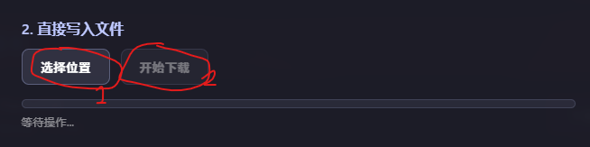
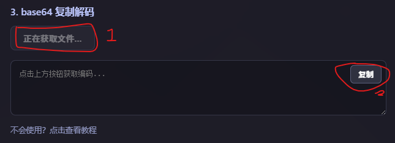
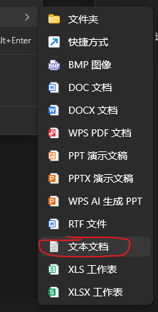
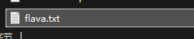

### flava 下载方法帮助文档

---

众所周知，有一群老师专门拦截我们的破解软件下载，特别的可恶
但是我们也准备了很多方法来绕过，以下是每一种方法的详解（按照成功概率从小到大排序，一种不行就下一种）：

1. 直接下载
点击下载按钮就下载了，没什么好说的

2. 直接写入文件
- 先点击“选择位置”按钮，选择你要下载的位置
- 然后点击“开始下载”，等它下载完

3. base64 复制解码
- 首先点击“开始并获取”按钮，等待一会儿
- 然后点击复制（可能会失败）

- 按下Win+R或打开开始菜单输入`%temp%`
- 创建一个文本文档文件，名为`flava.txt`

- 打开它，把刚才复制的内容粘贴进去
- 保存文件
- 在资源管理器地址栏输入`certutil -decode flava.txt flava.exe`或`powershell -command "[System.IO.File]::WriteAllBytes('output.bin', [System.Convert]::FromBase64String((Get-Content 'input.txt' -Raw)))"`并回车指令
- 下载完成

4. base64 托拽解码
- 首先点击“开始并获取”按钮，等待一会儿

- 按下Win+R或打开开始菜单输入`%temp%`
- 创建一个文本文档文件，名为`flava.txt`

- 打开它，再打开之前的网页，全选里面的所有内容，长按拖拽到记事本，再松开鼠标，不是复制！！！！
- 保存文件
- 在资源管理器地址栏输入`certutil -decode flava.txt flava.exe`或`powershell -command "[System.IO.File]::WriteAllBytes('output.bin', [System.Convert]::FromBase64String((Get-Content 'input.txt' -Raw)))"`并回车指令
- 下载完成